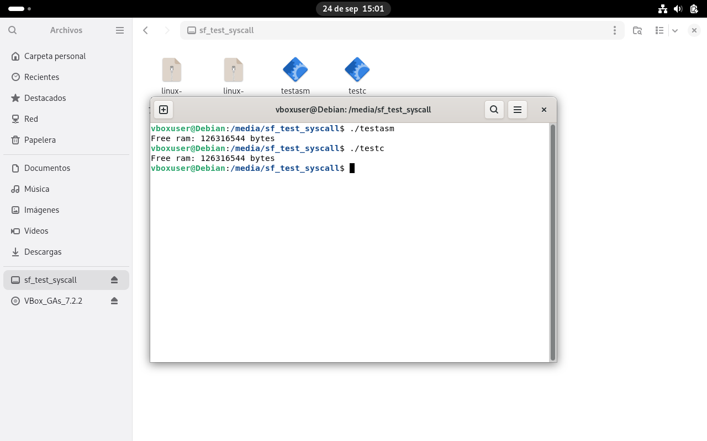

# Modificación del Kernel de Linux

Quise añadir un syscall propio al kernel (núcleo) de Linux y compilarlo yo mismo.
Aquí van los resultados y el como lo puedes hacer tú.

# ¿Cómo se añade un syscall?

Tienes que añadir la implementación del syscall al código fuente del kernel.
Yo lo he hecho en `ModLinuxKernel/linux/kernel/sys.c`

```c
SYSCALL_DEFINE1 (getfreeram, __kernel_ulong_t *, ram)
{
  /* creamos la struct sysinfo necesaria para obtener la información */
  struct sysinfo info;

  /* obtenemos la información */
  si_meminfo(&info);

  /* devolvemos */
  __kernel_ulong_t fram = info.freeram * info.mem_unit;

  if (copy_to_user(ram, &fram, sizeof(__kernel_ulong_t)))
    return -EFAULT;

  /* éxito */
  return 0;
  
}
```
El código de arriba simplemente obtiene la memoria ram no ocupada a partir de la función si_meminfo.

El código ese por si solo no hace nada, hay que decirle al Kernel que existe ese syscall. Por eso mismo,
añadimos la siguiente línea en el archivo `ModLinuxKernel/linux/arch/x86/entry/syscalls/syscall_64.tbl`

```
470     common  getfreeram              sys_getfreeram
```
Es importante que el nombre cuadre con el de la función y que en la cuarta columna vaya prefijado con 'sys'

# Compilación

Ahora simplemente hay que compilar. Yo concretamente lo voy a compilar en paquetes `.deb` para probar el kernel en una
máquina virtual Debian.

```bash
make -j$(nproc) bindeb-pkg
```

# Testeo

Yo he probado el syscall tanto desde C como desde el ensamblador GNU Gas, en test.c y test_asm.s, respectivamente.
Es cuestión de compilar los tests y pasarlos a la máquina virtual, en mi caso yo he usado VirtualBox de Oracle.

```bash
gcc -o testc test.c
gcc -nostartfiles -no-pie test_asm.s -o testasm
```

Luego hay que descargar el ISO del OS que quieras para testear, y "inyectarle" el kernel. Eso es simplemente instalar los paquetes
generados en la VM con:

```bash
dpkg -i paquete.deb
```

Yo solo instalo el que contiene headers y el que contiene imagen. Pero se puede instalar el que contiene el libc y el que está con imagen y
debugueado (pero obviamente es más lento)

# Resultados



# Bibliografía

1. Armstrong, Daniel Wayne. *Build a Custom Kernel Package for Debian*.  
   Guía paso a paso para descargar, configurar, compilar y empaquetar un kernel personalizado en Debian, incluyendo instalación de paquetes `.deb` y actualización del gestor de arranque.  
   Disponible en: [https://www.dwarmstrong.org/kernel/](https://www.dwarmstrong.org/kernel/)

2. Brennan, Stephen. *Tutorial - Write a System Call*.  
   Explicación detallada sobre cómo implementar una llamada al sistema personalizada en Linux, desde la configuración de la VM hasta la modificación del kernel, compilación y prueba del syscall. Incluye script para automatizar despliegue.  
   Disponible en: [https://brennan.io/2016/11/14/kernel-dev-ep3/](https://brennan.io/2016/11/14/kernel-dev-ep3/)

### Referencias de código fuente clave

3. Linux Kernel Source, archivo `kernel/sys.c`, línea 2915.  
   Implementación y definición de llamadas al sistema en el kernel Linux, incluyendo macros para definir syscalls y manejo de argumentos.  
   Código fuente en: [https://elixir.bootlin.com/linux/v6.16.8/source/kernel/sys.c#L2915](https://elixir.bootlin.com/linux/v6.16.8/source/kernel/sys.c#L2915)

4. Linux Kernel Source, archivo `include/linux/mm.h`, línea 3234.  
   Definiciones relacionadas con la gestión de memoria en el kernel, estructuras y macros para manejo de memoria virtual y física.  
   Código fuente en: [https://elixir.bootlin.com/linux/v6.16.8/source/include/linux/mm.h#L3234](https://elixir.bootlin.com/linux/v6.16.8/source/include/linux/mm.h#L3234)
